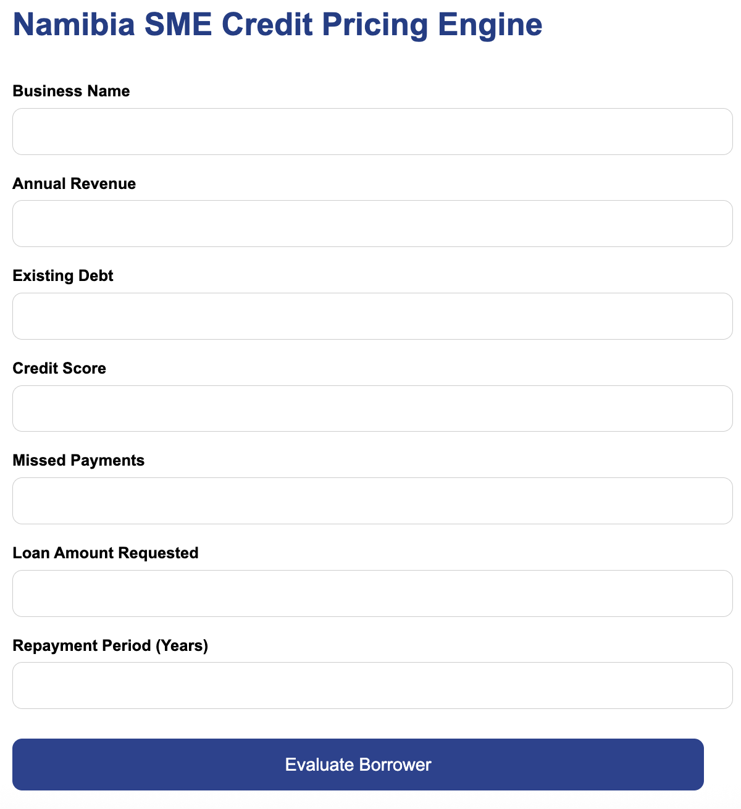
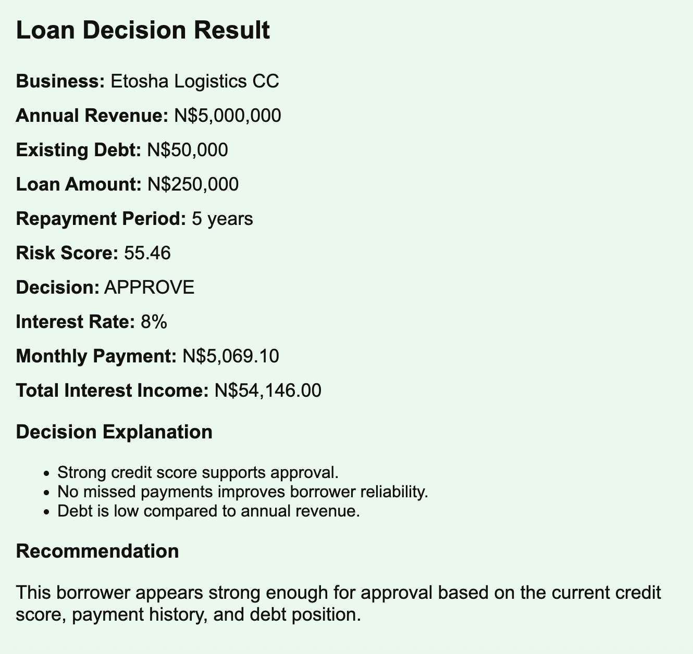
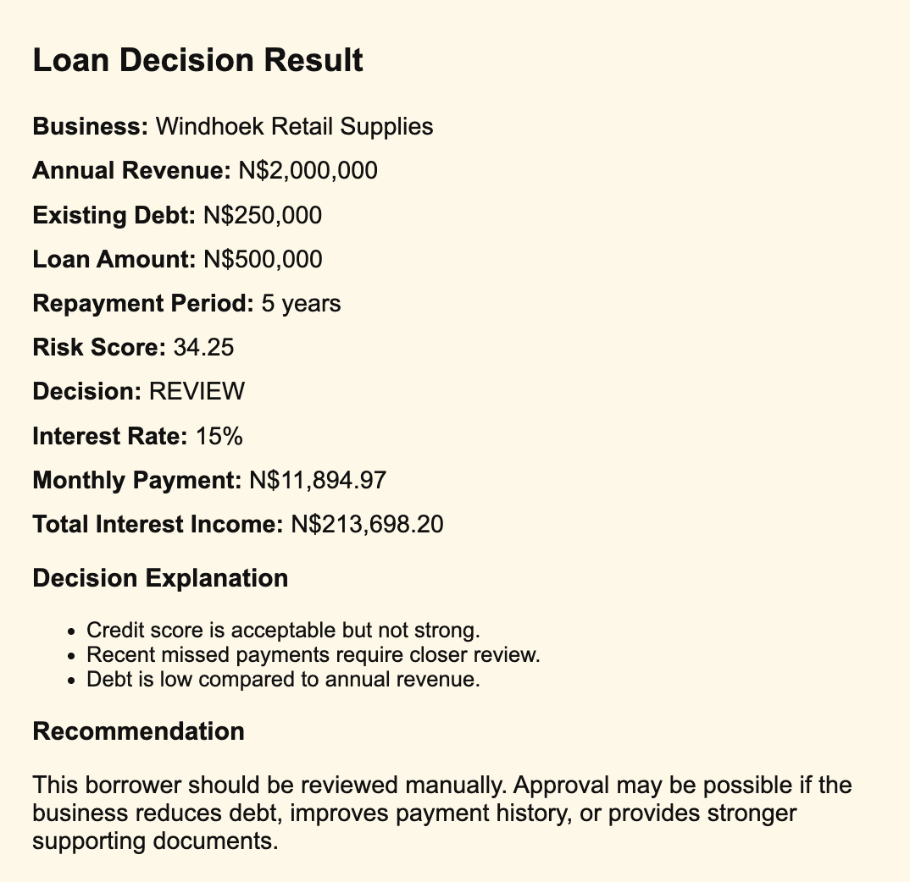
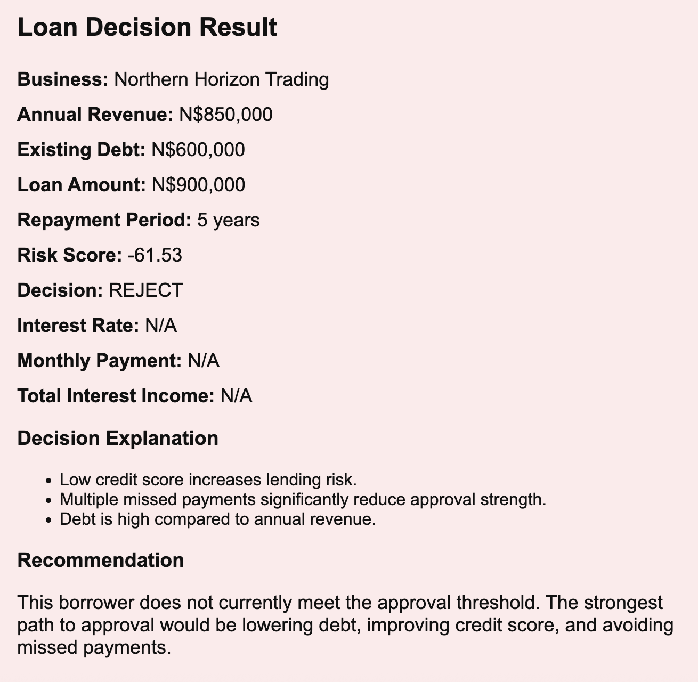

# Namibia SME Credit Risk & Pricing Engine

## Live Application

https://namibia-sme-credit-pricing-engine.onrender.com/

---

## Overview

This project is a web-based SME credit risk and loan pricing engine designed for the Namibian financial environment.

The application evaluates SME borrowers using financial and behavioral risk indicators, then determines:

- Risk score
- Loan approval decision
- Interest rate
- Monthly repayment amount
- Total interest income
- Credit recommendations

The system simulates how financial institutions assess lending risk and pricing decisions for small and medium-sized enterprises.

---

## Features

- Dynamic borrower evaluation
- Risk-based approval logic
- Automated loan pricing
- Monthly repayment calculations
- Approval, Review, and Rejection workflows
- Decision explanations and recommendations
- Live deployed Flask application
- Responsive web interface

---

## Technologies Used

- Python
- Flask
- HTML
- CSS
- GitHub
- Render
- Gunicorn

---

## Risk Decision Categories

### APPROVE
Low-risk borrowers with strong repayment potential.

### REVIEW
Medium-risk borrowers requiring manual assessment.

### REJECT
High-risk borrowers with elevated lending risk.

---

## Example Screenshots

### Web Application Interface

---

### Approved Borrower

---

### Review Borrower

---

### Rejected Borrower

---

## Business Use Case

This project demonstrates how analytics and rule-based modeling can support financial institutions in:

- SME lending decisions
- Risk segmentation
- Interest pricing strategy
- Revenue forecasting
- Credit assessment workflows

---

## Deployment

The application is deployed publicly using Render.

Live URL:

https://namibia-sme-credit-pricing-engine.onrender.com/

---

## Future Improvements

- Machine learning risk scoring
- SQL database integration
- Borrower history tracking
- Authentication system
- Power BI analytics dashboard
- Portfolio-level risk analysis

---

## Author

Tizee Kasete